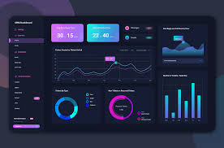

# Project name
My project is focus on....
## heading 2
### Setup / installation
`num install`

`pip install`

`composoer install`
### Todo list
- [ ] Home page
- [ ] About page
- [x] service page
### Screenshort

### link
CSS Framework [Tailwindcss](https://tailwindcss.com/)
### List
Unorder list
- one
- two
- Three
    - other sub list
    - kkk
---
Order list
1. One
2. Two
3. Three
### Text style

**Bbold text**

*hello world*

~~delete text~~
### Block quote
> Hello world

### Table
|id | name | Age |
|----|-----|---|
|01 | Rady | 100|

### Code
```python
for i in range(10):
    print(i)
```
```html
<h1> heading </h1>

